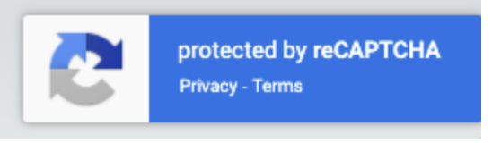

# Product Management System with Google reCAPTCHA v3

A modern Spring Boot web application for managing products with built-in Google reCAPTCHA v3 protection against spam and
automated attacks. This application demonstrates best practices for integrating reCAPTCHA v3 with all data modification
operations.



## Features

- **CRUD Operations**: Complete product management (Create, Read, Update, Delete)
- **Google reCAPTCHA v3**: Invisible, score-based bot protection for all POST/PUT/DELETE operations
- **Search Functionality**: Search products by name or description
- **Category Management**: Organize products by categories
- **Stock Tracking**: Monitor product inventory levels
- **Real-time Validation**: Client-side and server-side form validation
- **Responsive UI**: Bootstrap 5-based modern interface
- **H2 Database**: In-memory database for quick development and testing
- **RESTful Design**: Clean and intuitive URL structure

## Technologies Used

### Backend

- **Spring Boot 3.5.5** - Main application framework
- **Spring Web** - RESTful web services
- **Spring Data JPA** - Database access layer
- **Hibernate** - ORM framework
- **H2 Database** - In-memory database
- **Spring Validation** - Bean validation
- **Lombok** - Reduce boilerplate code
- **Java 21** - Programming language

### Frontend

- **Thymeleaf** - Server-side template engine
- **Bootstrap 5.1.3** - CSS framework
- **Font Awesome 6.0.0** - Icon library
- **Google reCAPTCHA v3** - Bot protection

### Build & Development

- **Maven** - Dependency management
- **Spring Boot DevTools** - Hot reload during development

## Google reCAPTCHA v3 Integration

This application implements **reCAPTCHA v3**, which provides invisible protection without user interaction.

### Key Features:

- **Invisible**: No checkbox or user challenge
- **Score-based**: Returns a score between 0.0 (likely bot) to 1.0 (likely human)
- **Minimum Score**: 0.5 (configurable in `RecaptchaService.java`)
- **Action-based**: Different actions for create, update, and delete operations

### Protected Operations:

1. **Create Product** - Action: `create_product`
2. **Update Product** - Action: `update_product`
3. **Delete Product** - Action: `delete_product`

### How It Works:

1. User submits a form
2. JavaScript executes `grecaptcha.execute()` to get a token
3. Token is sent to backend with form data
4. Backend validates token with Google's API
5. If score >= 0.5, operation proceeds; otherwise, rejected

## Prerequisites

- **Java 21** or higher
- **Maven 3.6+** (or use included Maven wrapper)
- **Google reCAPTCHA v3 Keys** (Site Key and Secret Key)

## Getting Started

### 1. Clone the Repository

```bash
git clone <repository-url>
cd capcay_v3-demo7
```

### 2. Obtain reCAPTCHA v3 Keys

1. Visit [Google reCAPTCHA Admin Console](https://www.google.com/recaptcha/admin)
2. Register a new site with **reCAPTCHA v3**
3. Add your domain(s) (for local development, use `localhost`)
4. Copy the **Site Key** and **Secret Key**

### 3. Configure reCAPTCHA Keys

Edit `src/main/resources/application.properties`:

```properties
# reCAPTCHA Configuration
recaptcha.site-key=YOUR_SITE_KEY_HERE
recaptcha.secret-key=YOUR_SECRET_KEY_HERE
recaptcha.enabled=true
```

**Note**: For production, use environment variables:

```properties
recaptcha.site-key=${RECAPTCHA_SITE_KEY}
recaptcha.secret-key=${RECAPTCHA_SECRET_KEY}
```

### 4. Build the Project

```bash
./mvnw clean install
```

Or on Windows:

```cmd
mvnw.cmd clean install
```

### 5. Run the Application

```bash
./mvnw spring-boot:run
```

Or on Windows:

```cmd
mvnw.cmd spring-boot:run
```

The application will start on **http://localhost:8080**

### 6. Access the Application

- **Main Page**: http://localhost:8080
- **Product List**: http://localhost:8080/products
- **H2 Console**: http://localhost:8080/h2-console
    - JDBC URL: `jdbc:h2:mem:testdb`
    - Username: `sa`
    - Password: (leave empty)

## Project Structure

```
capcay_v3-demo7/
├── src/
│   ├── main/
│   │   ├── java/
│   │   │   └── id/my/hendisantika/capcay_v3demo7/
│   │   │       ├── controller/
│   │   │       │   ├── HomeController.java
│   │   │       │   └── ProductController.java
│   │   │       ├── dto/
│   │   │       │   └── RecaptchaResponse.java
│   │   │       ├── entity/
│   │   │       │   └── Product.java
│   │   │       ├── repository/
│   │   │       │   └── ProductRepository.java
│   │   │       ├── service/
│   │   │       │   ├── ProductService.java
│   │   │       │   └── RecaptchaService.java
│   │   │       └── CapcayV3Demo7Application.java
│   │   └── resources/
│   │       ├── templates/
│   │       │   ├── layout.html
│   │       │   └── products/
│   │       │       ├── create.html
│   │       │       ├── edit.html
│   │       │       ├── list.html
│   │       │       └── view.html
│   │       └── application.properties
│   └── test/
│       └── java/
│           └── id/my/hendisantika/capcay_v3demo7/
│               └── CapcayV3Demo7ApplicationTests.java
├── pom.xml
└── README.md
```

## Database Schema

### Product Table

| Column         | Type          | Constraints                 | Description               |
|----------------|---------------|-----------------------------|---------------------------|
| id             | BIGINT        | PRIMARY KEY, AUTO_INCREMENT | Unique product identifier |
| name           | VARCHAR(255)  | NOT NULL                    | Product name              |
| description    | TEXT          | -                           | Product description       |
| price          | DECIMAL(10,2) | NOT NULL, POSITIVE          | Product price             |
| stock_quantity | INTEGER       | NOT NULL                    | Available stock           |
| category       | VARCHAR(255)  | -                           | Product category          |
| created_at     | TIMESTAMP     | -                           | Creation timestamp        |
| updated_at     | TIMESTAMP     | -                           | Last update timestamp     |

## API Endpoints

| Method | Endpoint                   | Description               | reCAPTCHA |
|--------|----------------------------|---------------------------|-----------|
| GET    | `/`                        | Redirect to products list | No        |
| GET    | `/products`                | List all products         | No        |
| GET    | `/products?search={query}` | Search products           | No        |
| GET    | `/products/new`            | Show create form          | No        |
| POST   | `/products`                | Create new product        | **Yes**   |
| GET    | `/products/{id}`           | View product details      | No        |
| GET    | `/products/{id}/edit`      | Show edit form            | No        |
| POST   | `/products/{id}`           | Update product            | **Yes**   |
| POST   | `/products/{id}/delete`    | Delete product            | **Yes**   |

## Configuration Options

### Application Properties

```properties
# Application Name
spring.application.name=capcay_v3-demo7
# H2 Database Configuration
spring.datasource.url=jdbc:h2:mem:testdb
spring.datasource.driverClassName=org.h2.Driver
spring.datasource.username=sa
spring.datasource.password=
# JPA/Hibernate Configuration
spring.jpa.database-platform=org.hibernate.dialect.H2Dialect
spring.jpa.hibernate.ddl-auto=create-drop
spring.h2.console.enabled=true
# reCAPTCHA Configuration
recaptcha.site-key=${YOUR_SITE_KEY}
recaptcha.secret-key=${YOUR_SECRET_KEY}
recaptcha.enabled=true
```

### Customizing reCAPTCHA Score Threshold

Edit `RecaptchaService.java` to change the minimum score:

```java
private static final double MINIMUM_SCORE = 0.5; // Change this value (0.0 - 1.0)
```

**Recommended Scores**:

- **0.5**: Balanced protection (default)
- **0.3**: More lenient (fewer false positives)
- **0.7**: Stricter protection (may block legitimate users)

## Testing

### Run All Tests

```bash
./mvnw test
```

### Run with Coverage

```bash
./mvnw clean test jacoco:report
```

## Development

### Enable Hot Reload

Spring Boot DevTools is included for automatic restart during development. Simply make changes to your code and the
application will automatically restart.

### Disable reCAPTCHA for Testing

Set in `application.properties`:

```properties
recaptcha.enabled=false
```

## Production Deployment

### Important Considerations

1. **Use Environment Variables** for sensitive data:
   ```bash
   export RECAPTCHA_SITE_KEY="your-site-key"
   export RECAPTCHA_SECRET_KEY="your-secret-key"
   ```

2. **Use Production Database**: Replace H2 with PostgreSQL, MySQL, etc.

3. **Configure reCAPTCHA Domains**: Add your production domain(s) in Google reCAPTCHA Admin Console

4. **Enable HTTPS**: reCAPTCHA requires HTTPS in production

5. **Update Database Configuration**:
   ```properties
   spring.datasource.url=jdbc:postgresql://localhost:5432/productdb
   spring.datasource.username=${DB_USERNAME}
   spring.datasource.password=${DB_PASSWORD}
   spring.jpa.hibernate.ddl-auto=validate
   ```

### Build Production JAR

```bash
./mvnw clean package -DskipTests
```

The JAR file will be in `target/capcay_v3-demo7-0.0.1-SNAPSHOT.jar`

### Run Production JAR

```bash
java -jar target/capcay_v3-demo7-0.0.1-SNAPSHOT.jar
```

## Troubleshooting

### reCAPTCHA Not Working

1. **Check Keys**: Ensure Site Key and Secret Key are correct
2. **Check Domain**: Verify domain is registered in reCAPTCHA console
3. **Check Browser Console**: Look for JavaScript errors
4. **Check Logs**: Review application logs for API errors

### Database Issues

1. **H2 Console Not Accessible**: Ensure `spring.h2.console.enabled=true`
2. **Data Not Persisting**: H2 in-memory database resets on restart (by design)

### Build Issues

1. **Java Version**: Ensure Java 21 is installed and set as default
2. **Maven Issues**: Use included wrapper (`./mvnw` or `mvnw.cmd`)

## Contributing

1. Fork the repository
2. Create a feature branch (`git checkout -b feature/amazing-feature`)
3. Commit your changes (`git commit -m 'Add amazing feature'`)
4. Push to the branch (`git push origin feature/amazing-feature`)
5. Open a Pull Request

## License

This project is created for educational and demonstration purposes.

## Author

**Hendi Santika**

- Email: hendisantika@gmail.com
- Telegram: @hendisantika34

## Acknowledgments

- Spring Boot Team for the excellent framework
- Google for reCAPTCHA v3 API
- Bootstrap Team for the UI framework
- Font Awesome for the icons

## Additional Resources

- [Spring Boot Documentation](https://spring.io/projects/spring-boot)
- [Google reCAPTCHA v3 Documentation](https://developers.google.com/recaptcha/docs/v3)
- [Thymeleaf Documentation](https://www.thymeleaf.org/documentation.html)
- [Bootstrap 5 Documentation](https://getbootstrap.com/docs/5.1/)

## Version History

- **0.0.1-SNAPSHOT** (2024-11-11)
    - Initial release
    - Product CRUD operations
    - Google reCAPTCHA v3 integration
    - Bootstrap 5 UI
    - H2 in-memory database
